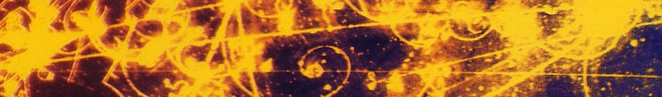

# Técnicas en Detección de Partículas 

## Primer semestre de 2018

### Programa del Doble Doctorado en Astrofísica (DDAp), [ITeDA](http://www.iteda.cnea.gov.ar/)-[UNSAM](http://www.unsam.edu.ar/) y [KIT](https://www.kit.edu/)

**Curso destinado a estudiantes de Maestría o Doctorado en Física, Ciencias o Ingeniería**

# Contenidos

## [Encuentros](https://github.com/asoreyh/cosito/tree/master/encuentros)

## [Referencias](https://github.com/asoreyh/cosito/tree/master/referencias)

## [Códigos](https://github.com/asoreyh/cosito/tree/master/codigos)

## [Materiales](https://github.com/asoreyh/cosito/tree/master/materiales)

# Objetivo general

**Aprender a transformar una idea en un proyecto**

# Objetivo específico 

**Adquirir nociones básicas para el diseño, la construcción, la
caracterización, el funcionamiento, la adquisición y el análisis de datos de un
detector de partículas.**

# Metodología

Se crearán tres grupos de trabajo: WP0 (coordinación), WP1 (hardware) y WP2
(fenomenología). Los estudiantes se unirán en al menos dos de estos tres grupos
de trabajo, y participarán activamente en todas las etapas del proyecto.

El curso tiene una duración total de ciento veinte (120) horas, y estará
compuesto por treinta (30) módulos de cuatro (4) horas de duración cada uno.
Diecinueve (19) módulos estarán dedicados a generar ambientes de trabajo SOLE
(*Self Organizing Learning Enviroments*) guiados por el docente, con el
objetivo de generar los ámbitos de discusión necesarios para el aprendizaje de
los principios físicos involucrados en las distintas etapas a lo largo de la
ejecución del proyecto.  La planificación, el diseño electrónico y mecánico, la
discusión de ideas y resultados también tendrán lugar en estos encuentros.
Otros diez (10) módulos estarán dedicados a la ejecución de los trabajos
individuales que surjan y se asignen durante los encuentros grupales.  Al
finalizar se destinarán el último módulo para la realización de un Taller de
discusión e intercambio de experiencias, resultados y aprendizajes. 

La evaluación de cada estudiante se llevará a cabo de manera continua durante
todas las etapas del aprendizaje. 

# Contenidos mínimos

Principios de interacción de la radiación con la materia. Técnicas
experimentales en detección de partículas. Tipos de Detectores. Centelladores.
Detectores de fotones:fotomultiplicadores convencionales (PMT) y contadores
multipíxeles en matriz de Silicio (MPPC-SiPM). Técnicas de Análisis de datos.
Programación científica. Técnicas de simulación de detectores de partículas.
Electrónica rápida y ultra-rápida. Medición por tiempo de vuelo. Conceptos
mecánicos para la construcción de detectores. Coordinación científica.

# Bibliografía obligatoria y complementaria 

Cualquier libro que cubra las bases de la detección de radiación, el análisis
de datos y la programación científica está dentro de los alcances de este
curso. Una lista no excluyente podría incluir a los siguientes libros y notas:

* Glen F. Knoll, Radiation Detection and Measurement, 4th Edition,  Wiley &
  Sons, 2010, ISBN 9780470131480
* Paul Horowitz, The Art of the Electronics, 3rd Edition, Cambridge University
  Press, 2015, ISBN 9780521809269
* Gordon Gilmore, Practical Gamma-ray Spectroscopy, 2nd Edition,
  Wiley-Balckwell, 2008, ISBN 9780470861967
* Lucio Cerrito, Radiation and Detectors: Introduction to the Physics of
  Radiation and Detection Devices, 1st Edition, 2017, ISBN 9783319531793
* Christian Joram, Particles Interactions with matter and Detector Design
  Principles, [Lecture Notes of the 2010 ICFA
  School](http://fisica.cab.cnea.gov.ar/particulas/html/icfa/lectures.php),
  Bariloche, 2010, [Part
  1](http://fisica.cab.cnea.gov.ar/particulas/html/icfa/pdf/Joram01.pdf), [Part
  2](http://fisica.cab.cnea.gov.ar/particulas/html/icfa/pdf/Joram02.pdf), [Part
  3](http://fisica.cab.cnea.gov.ar/particulas/html/icfa/pdf/Joram03.pdf), [Part
  4](http://fisica.cab.cnea.gov.ar/particulas/html/icfa/pdf/Joram04.pdf), [Part
  5](http://fisica.cab.cnea.gov.ar/particulas/html/icfa/pdf/Joram05.pdf).
* Christian Hill, Learning Scientific Programming with Python, 1st Edition,
  Cambridge University Press, 2016, ISBN 9781107428225
* Kristian Rother, [Time Management for
  Scientists](https://legacy.gitbook.com/book/krother/time-management-for-scientists)
, 1st Edition, GitBook, 2017
* Jack Leeming, [Management 101 for scientists - three rules for managing a
  successful
  team](http://blogs.nature.com/naturejobs/2017/08/16/management-101-for-scientists-three-rules-for-managing-a-successful-team/),
  NatureJobs, 16 Aug 2017.
* Carl Cohen, Lab Dynamics: Management and Leadership Skills for Scientists,
  2nd Edition, Cold Spring Harbor Laboratory Press, 2012, ISBN 9781936113781
* Sugata Mitra, [Building a School in the
  Cloud](https://www.ted.com/talks/sugata_mitra_build_a_school_in_the_cloud?language=es),
  TED 2013 Conference, Feb 2013. 

## Evolución del curso

* **Fecha de inicio**: a confirmar. 
* **Fecha de finalización**: a confirmar.
* **Días y horarios de los encuentros**: a confirmar.

* Viernes 20/Abr/2018: Reunión informativa del curso.

#### (C) 2018 ... - Hernán Asorey ([@asoreyh](https://twitter.com/asoreyh/))

 Este trabajo se distribuye en forma gratuita bajo la <a rel="license" href="http://creativecommons.org/licenses/by-nc-sa/4.0/">Licencia Creative Commons Attribution-NonCommercial-ShareAlike 4.0 International</a>.
